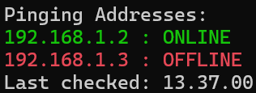
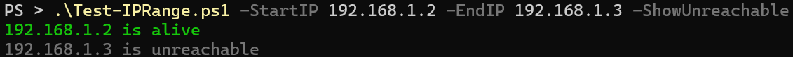

# Powershell

## Ping-Multiple.ps1

Allows for simultaneous pinging to multiple addresses.
```powershell
.\Ping-Multiple.ps1 -IPList "<list>"
```


## Test-IPRange.ps1

Up to 90% faster subnet scanning across a full `/24` range compared to scripts using [Test-Connection](https://learn.microsoft.com/en-us/powershell/module/microsoft.powershell.management/test-connection?view=powershell-7.5).

```powershell
.\Test-IPRange.ps1 -StartIP "<start>" -EndIP "<end>" [-Timeout <ms>] [-ShowUnreachable]
```
| Parameter | Description |
| --------- | ----------- |
| -StartIP | Starting IP address, e.g. `192.168.1.1` |
| -EndIP | Ending IP address, e.g. `192.168.1.255` |
| -Timeout | Ping timeout in milliseconds, default: `100` |
| -ShowUnreachable | Display unreachable IPs |

